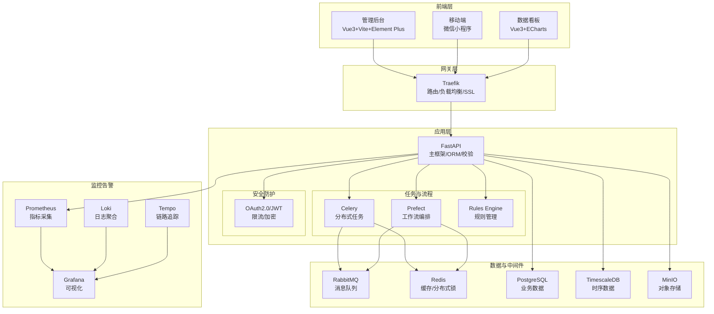

### **Axiom MES 智能生产系统**

**面向制造企业的全流程生产执行管理平台**

[](#) <!-- 示例徽章 -->
[](#license)

#### **特性**

*   **全流程管理**: 从订单接收到成品出库的端到端数字化管理。
*   **策略自动化**: 通过规则引擎和工作流编排实现生产策略的自动化执行。
*   **实时监控**: 提供实时的生产指标和数据可视化看板。
*   **智能决策**: 集成规则引擎，支持动态规则配置与执行。
*   **高可用与可观测**: 基于容器化部署，提供完整的监控、日志和告警体系。

#### **简介**

Axiom MES 智能生产系统是一个现代化的制造执行系统 (MES)，专为制造企业设计。它通过整合 BOM 管理、生产排程、工序执行、质量管理、员工技能画像等功能，帮助企业实现生产过程的数字化、智能化，从而提升效率、降低成本、保障质量。系统核心在于其策略自动化管理能力，通过灵活的规则引擎和强大的工作流编排工具，实现复杂的生产逻辑自动化。

#### **技术架构**

系统采用现代化的微服务架构，技术栈主要包括：

*   **前端**: Vue 3, Vite, Element Plus, ECharts
*   **后端**: Python 3.14, FastAPI, SQLAlchemy 2.0, Pydantic
*   **任务队列**: Celery, Prefect
*   **消息队列**: RabbitMQ
*   **缓存**: Redis 8
*   **数据库**: PostgreSQL 18, TimescaleDB
*   **对象存储**: MinIO
*   **监控**: Prometheus, Grafana, Loki, Tempo
*   **网关**: Traefik
*   **部署**: Docker, Docker Compose

系统架构图（Mermaid）:



#### **快速开始**

**1. 克隆项目**

```bash
git clone https://github.com/Amanda-Gill/AxiomMES.git
cd axiom-mes
```

**2. 配置环境变量**

复制 `.env.example` 文件并重命名为 `.env`，然后根据您的环境修改其中的配置项（如数据库密码、密钥等）。

```bash
cp .env.example .env
# 编辑 .env 文件
nano .env
```

**3. 启动服务**

使用 Docker Compose 构建并启动所有服务。

```bash
docker-compose up -d --build
```

**4. 访问应用**

*   **管理后台**: `https://mes-system.com` (Traefik 路由)
*   **API 文档**: `https://api.mes-system.com/docs` (Traefik 路由)
*   **Grafana 监控**: `http://localhost:3000` (直接访问)
*   **Traefik Dashboard**: `http://localhost:8080` (直接访问)

#### **配置**

项目使用 `.env` 文件管理环境变量。请参考 `11.1 环境变量` 部分了解关键配置项。

#### **部署**

项目已通过 Docker 和 Docker Compose 完全容器化。生产部署时，请确保：
*   服务器满足 Docker 和 Docker Compose 的运行要求。
*   已正确配置 `.env` 文件中的生产环境密钥和参数。
*   已配置好域名和 SSL 证书（Traefik 自动处理）。
*   定期备份数据卷（PostgreSQL, TimescaleDB, MinIO, Grafana, Loki 等）。

#### **贡献**

欢迎任何形式的贡献！请阅读我们的 [贡献指南](./CONTRIBUTING.md) (假定存在此文件) 了解如何开始。主要的贡献方式包括：
*   报告 Bug
*   提交功能请求
*   提交代码改进 (Pull Requests)
*   完善文档

#### **许可证**

本项目受私有许可证保护，仅供内部或授权使用。

#### **联系方式**

*   项目负责人: [363679401@qq.com](mailto:363679401@qq.com)
*   最后更新: 2026-02-21

---
