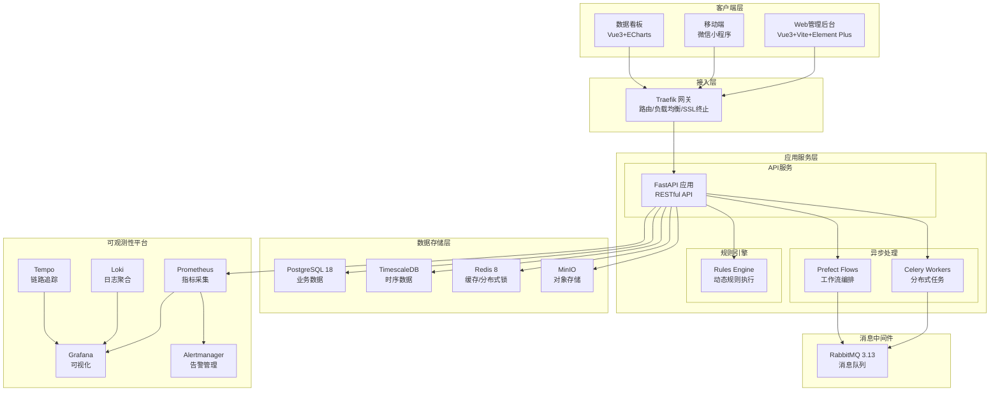
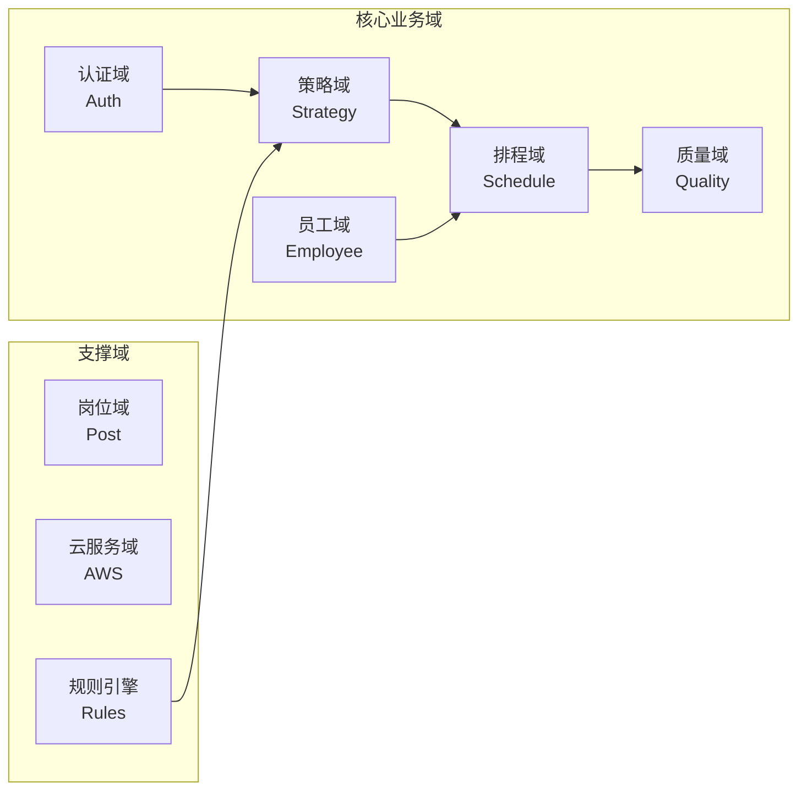
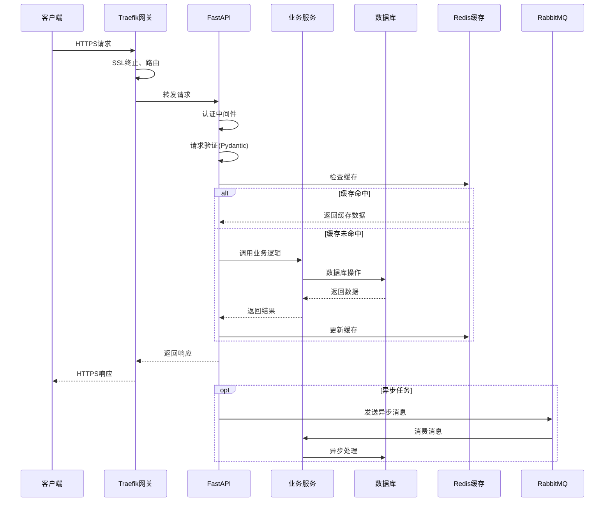
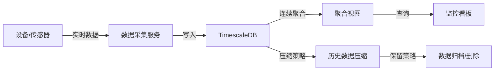
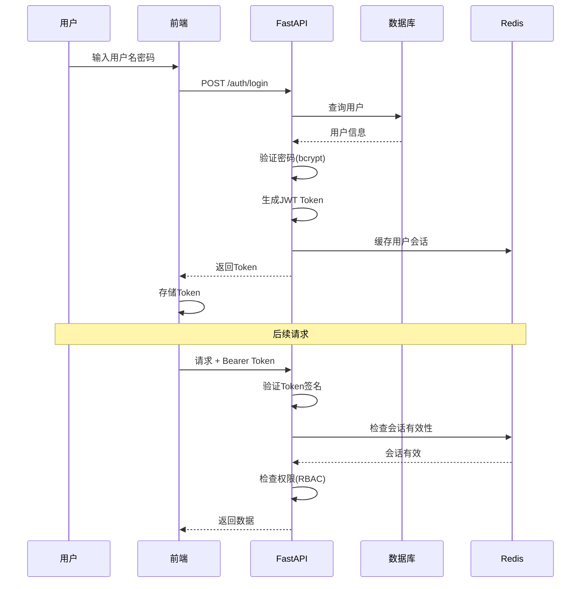
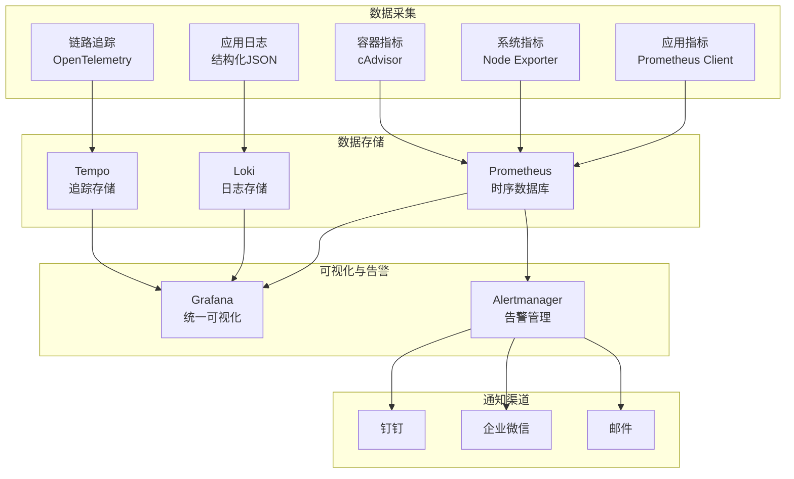

# Axiom MES 智能生产系统 - 架构设计文档

**文档版本**：1.0  
**最后更新**：2026-03-10  
**维护团队**：MES 架构组  
**联系方式**：363679401@qq.com

---

## 目录

1. [系统概述](#1-系统概述)
2. [架构设计原则](#2-架构设计原则)
3. [系统架构](#3-系统架构)
4. [技术选型](#4-技术选型)
5. [核心模块设计](#5-核心模块设计)
6. [数据流设计](#6-数据流设计)
7. [安全架构](#7-安全架构)
8. [可观测性设计](#8-可观测性设计)
9. [扩展性设计](#9-扩展性设计)

---

## 1. 系统概述

### 1.1 项目背景

Axiom MES 智能生产系统是一套面向制造企业的全流程生产执行管理平台。系统通过整合 BOM 管理、生产排程、工序执行、质量管理、员工技能画像等功能，帮助企业实现生产过程的数字化、智能化，从而提升效率、降低成本、保障质量。

### 1.2 系统目标

- **全流程管理**：从订单接收到成品出库的端到端数字化管理
- **策略自动化**：通过规则引擎和工作流编排实现生产策略的自动化执行
- **实时监控**：提供实时的生产指标和数据可视化看板
- **智能决策**：集成规则引擎，支持动态规则配置与执行
- **高可用与可观测**：基于容器化部署，提供完整的监控、日志和告警体系

### 1.3 系统边界

```
┌─────────────────────────────────────────────────────────────┐
│                      外部系统                                │
│  ┌──────────┐  ┌──────────┐  ┌──────────┐  ┌──────────┐   │
│  │  ERP系统  │  │  WMS系统  │  │  设备系统  │  │  金蝶API  │   │
│  └────┬─────┘  └────┬─────┘  └────┬─────┘  └────┬─────┘   │
└───────┼─────────────┼─────────────┼─────────────┼─────────┘
        │             │             │             │
        └─────────────┴──────┬──────┴─────────────┘
                             │
                    ┌────────▼────────┐
                    │   Axiom MES     │
                    │   智能生产系统   │
                    └─────────────────┘
```

---

## 2. 架构设计原则

### 2.1 核心原则

| 原则 | 说明 | 实践方式 |
|------|------|----------|
| **微服务化** | 业务域独立，服务解耦 | 按业务域划分模块（auth、strategy、schedule等） |
| **容器化部署** | 环境一致性，快速交付 | Docker + Docker Compose / Kubernetes |
| **可观测性** | 全链路监控，快速定位问题 | Prometheus + Grafana + Loki + Tempo |
| **高可用** | 故障隔离，自动恢复 | 多副本部署、健康检查、自动重启 |
| **安全优先** | 纵深防御，最小权限 | OAuth2 + JWT、RBAC、数据加密 |
| **异步优先** | 削峰填谷，提升吞吐 | Celery + RabbitMQ、Prefect 工作流 |

### 2.2 设计模式

- **DDD（领域驱动设计）**：按业务域组织代码结构
- **CQRS**：读写分离，时序数据独立存储
- **事件驱动**：通过消息队列实现服务间解耦
- **策略模式**：规则引擎支持动态规则配置

---

## 3. 系统架构

### 3.1 整体架构图



### 3.2 分层架构

```
┌─────────────────────────────────────────────────────────────┐
│                      表现层 (Presentation)                   │
│  ┌─────────────┐  ┌─────────────┐  ┌─────────────┐         │
│  │  Web Admin  │  │  Dashboard  │  │  Mini App   │         │
│  └─────────────┘  └─────────────┘  └─────────────┘         │
└─────────────────────────────────────────────────────────────┘
                              │
                              ▼
┌─────────────────────────────────────────────────────────────┐
│                      网关层 (Gateway)                        │
│  ┌─────────────────────────────────────────────────────┐   │
│  │  Traefik: 路由、负载均衡、SSL终止、限流              │   │
│  └─────────────────────────────────────────────────────┘   │
└─────────────────────────────────────────────────────────────┘
                              │
                              ▼
┌─────────────────────────────────────────────────────────────┐
│                      应用层 (Application)                    │
│  ┌──────────┐  ┌──────────┐  ┌──────────┐  ┌──────────┐   │
│  │   Auth   │  │ Strategy │  │ Schedule │  │ Quality  │   │
│  │  认证域  │  │  策略域  │  │  排程域  │  │  质量域  │   │
│  └──────────┘  └──────────┘  └──────────┘  └──────────┘   │
│  ┌──────────┐  ┌──────────┐  ┌──────────┐  ┌──────────┐   │
│  │ Employee │  │   Post   │  │   AWS    │  │   ...    │   │
│  │  员工域  │  │  岗位域  │  │  云服务  │  │          │   │
│  └──────────┘  └──────────┘  └──────────┘  └──────────┘   │
└─────────────────────────────────────────────────────────────┘
                              │
                              ▼
┌─────────────────────────────────────────────────────────────┐
│                      领域层 (Domain)                         │
│  ┌─────────────────────────────────────────────────────┐   │
│  │  业务逻辑、规则引擎、工作流编排                       │   │
│  └─────────────────────────────────────────────────────┘   │
└─────────────────────────────────────────────────────────────┘
                              │
                              ▼
┌─────────────────────────────────────────────────────────────┐
│                      基础设施层 (Infrastructure)             │
│  ┌────────┐  ┌────────┐  ┌────────┐  ┌────────┐  ┌────────┐│
│  │Postgres│  │Timescale│  │ Redis  │  │RabbitMQ│  │ MinIO ││
│  └────────┘  └────────┘  └────────┘  └────────┘  └────────┘│
└─────────────────────────────────────────────────────────────┘
```

---

## 4. 技术选型

### 4.1 技术栈总览

| 层级 | 技术组件 | 版本 | 选型理由 |
|------|----------|------|----------|
| **前端框架** | Vue | 3.4.x | 组合式API、更好的TypeScript支持 |
| **构建工具** | Vite | 5.x | 快速冷启动、HMR |
| **UI组件库** | Element Plus | 2.x | 企业级组件丰富、中文支持好 |
| **状态管理** | Pinia | 2.x | 轻量、TypeScript友好 |
| **图表库** | ECharts | 5.x | 功能强大、适合大屏展示 |
| **后端框架** | FastAPI | 0.115.x | 高性能、异步支持、自动文档 |
| **运行时** | Python | 3.14-slim | 最新特性、性能优化 |
| **ORM** | SQLAlchemy | 2.0.x | 异步支持、类型提示完善 |
| **数据验证** | Pydantic | 2.x | 性能优秀、与FastAPI深度集成 |
| **任务队列** | Celery | 5.5.x | 成熟稳定、分布式支持 |
| **工作流** | Prefect | 2.19.x | 现代化、可视化编排 |
| **关系数据库** | PostgreSQL | 18-alpine | 性能优秀、扩展性强 |
| **时序数据库** | TimescaleDB | 2.25.1-pg18 | 基于PostgreSQL、时序优化 |
| **缓存** | Redis | 8.6.0-alpine | 高性能、支持分布式锁 |
| **消息队列** | RabbitMQ | 3.13-management | 可靠性高、管理界面友好 |
| **对象存储** | MinIO | RELEASE.2025-09-07 | S3兼容、高性能 |
| **网关** | Traefik | v3.6.8 | 云原生、自动服务发现 |
| **监控** | Prometheus | v3.9.1 | 生态完善、告警强大 |
| **可视化** | Grafana | 12.4.0 | 多数据源、插件丰富 |
| **日志** | Loki | 3.6.6 | 轻量级、与Grafana集成好 |
| **追踪** | Tempo | 2.9.1 | 高性能、兼容OpenTelemetry |
| **告警** | Alertmanager | v0.31.1 | 告警分组、抑制、静默 |

### 4.2 技术选型决策

#### 4.2.1 为什么选择 FastAPI？

```
┌─────────────────────────────────────────────────────────────┐
│                    FastAPI 优势分析                          │
├─────────────────────────────────────────────────────────────┤
│ ✅ 高性能：基于 Starlette 和 Pydantic，性能接近 Node.js     │
│ ✅ 异步支持：原生支持 async/await，适合 I/O 密集型场景       │
│ ✅ 自动文档：Swagger UI 和 ReDoc 自动生成                   │
│ ✅ 类型安全：基于 Python 类型提示，IDE 支持好               │
│ ✅ 依赖注入：内置 DI 系统，便于测试和解耦                   │
│ ✅ 验证器：Pydantic 集成，数据验证简单强大                  │
└─────────────────────────────────────────────────────────────┘
```

#### 4.2.2 为什么选择 Vue 3？

```
┌─────────────────────────────────────────────────────────────┐
│                    Vue 3 优势分析                            │
├─────────────────────────────────────────────────────────────┤
│ ✅ 组合式 API：更好的逻辑复用和代码组织                      │
│ ✅ TypeScript：原生支持，类型推导完善                        │
│ ✅ 性能优化：虚拟 DOM 重写，Tree-shaking 支持               │
│ ✅ 生态成熟：Element Plus、Pinia、Vue Router 等配套完善     │
│ ✅ 学习曲线：渐进式框架，上手容易                            │
└─────────────────────────────────────────────────────────────┘
```

#### 4.2.3 为什么选择 TimescaleDB？

```
┌─────────────────────────────────────────────────────────────┐
│                  TimescaleDB 优势分析                        │
├─────────────────────────────────────────────────────────────┤
│ ✅ PostgreSQL 兼容：无需学习新数据库，SQL 完全兼容          │
│ ✅ 时序优化：自动分区、压缩策略、连续聚合                    │
│ ✅ 运维简单：无需额外部署，作为 PostgreSQL 扩展              │
│ ✅ 成本优势：压缩率高，存储成本降低 90%+                     │
│ ✅ 查询性能：时序查询性能提升 10-100 倍                      │
└─────────────────────────────────────────────────────────────┘
```

---

## 5. 核心模块设计

### 5.1 业务域划分



### 5.2 模块职责

| 模块 | 职责 | 核心功能 |
|------|------|----------|
| **auth** | 认证授权 | 用户登录、JWT令牌、权限管理、RBAC |
| **strategy** | 策略管理 | 生产策略配置、策略执行、策略历史 |
| **schedule** | 生产排程 | 排程计划、工单管理、资源分配 |
| **quality** | 质量管理 | 质检标准、检验记录、异常处理 |
| **employee** | 员工管理 | 员工信息、技能画像、培训记录 |
| **posts** | 岗位管理 | 岗位定义、职责分配 |
| **aws** | 云服务集成 | S3存储、消息推送等云服务 |
| **rules** | 规则引擎 | 规则定义、规则执行、规则版本管理 |

### 5.3 模块内部结构

每个业务域遵循统一的模块结构：

```
src/{domain}/
├── router.py        # 路由定义（API端点）
├── schemas.py       # Pydantic 模型（请求/响应）
├── models.py        # SQLAlchemy 模型（数据库表）
├── service.py       # 业务逻辑层
├── dependencies.py  # 依赖注入
├── exceptions.py    # 领域异常
├── constants.py     # 常量定义
├── utils.py         # 工具函数
└── tasks.py         # Celery 异步任务
```

---

## 6. 数据流设计

### 6.1 请求处理流程



### 6.2 数据流转图

```
┌─────────────────────────────────────────────────────────────────┐
│                        数据流转全景                              │
└─────────────────────────────────────────────────────────────────┘

外部数据源                    系统内部处理                    数据存储
┌─────────┐                ┌─────────────┐              ┌─────────┐
│ ERP系统 │───────────────▶│  数据同步    │─────────────▶│PostgreSQL│
└─────────┘                │  (Celery)   │              └─────────┘
                           └─────────────┘
┌─────────┐                ┌─────────────┐              ┌─────────┐
│ 设备系统 │───────────────▶│  数据采集    │─────────────▶│TimescaleDB│
└─────────┘                │  (Prefect)  │              └─────────┘
                           └─────────────┘
┌─────────┐                ┌─────────────┐              ┌─────────┐
│ 金蝶API │───────────────▶│  API集成    │─────────────▶│PostgreSQL│
└─────────┘                │  (FastAPI)  │              └─────────┘
                           └─────────────┘
                                  │
                                  ▼
                           ┌─────────────┐              ┌─────────┐
                           │  规则引擎    │─────────────▶│  Redis  │
                           │  (Rules)    │              │ (缓存)  │
                           └─────────────┘              └─────────┘
                                  │
                                  ▼
                           ┌─────────────┐              ┌─────────┐
                           │  消息队列    │─────────────▶│ RabbitMQ│
                           │ (RabbitMQ)  │              │         │
                           └─────────────┘              └─────────┘
```

### 6.3 时序数据处理流程



### 6.4 缓存策略

| 数据类型 | 缓存策略 | TTL | 说明 |
|----------|----------|-----|------|
| 用户信息 | Cache-Aside | 30分钟 | 登录后缓存，修改时失效 |
| 权限数据 | Cache-Aside | 1小时 | 权限变更时主动失效 |
| 配置数据 | Read-Through | 10分钟 | 配置中心更新时失效 |
| 热点数据 | Write-Through | 5分钟 | 写入时同时更新缓存 |
| 时序数据 | 不缓存 | - | 直接查询TimescaleDB |

---

## 7. 安全架构

### 7.1 安全分层

```
┌─────────────────────────────────────────────────────────────┐
│                     安全架构分层                             │
├─────────────────────────────────────────────────────────────┤
│                                                             │
│  ┌─────────────────────────────────────────────────────┐   │
│  │  网络安全层                                          │   │
│  │  • HTTPS (Traefik + Let's Encrypt)                  │   │
│  │  • CORS 策略                                        │   │
│  │  • 速率限制                                         │   │
│  │  • DDoS 防护                                        │   │
│  └─────────────────────────────────────────────────────┘   │
│                           │                                 │
│                           ▼                                 │
│  ┌─────────────────────────────────────────────────────┐   │
│  │  应用安全层                                          │   │
│  │  • OAuth2 + JWT 认证                                │   │
│  │  • RBAC 权限控制                                    │   │
│  │  • 输入验证 (Pydantic)                              │   │
│  │  • SQL 注入防护 (ORM)                               │   │
│  │  • XSS 防护                                         │   │
│  └─────────────────────────────────────────────────────┘   │
│                           │                                 │
│                           ▼                                 │
│  ┌─────────────────────────────────────────────────────┐   │
│  │  数据安全层                                          │   │
│  │  • 敏感数据加密 (AES-256)                           │   │
│  │  • 密码哈希 (bcrypt)                                │   │
│  │  • 数据库连接加密                                    │   │
│  │  • 备份加密                                         │   │
│  └─────────────────────────────────────────────────────┘   │
│                           │                                 │
│                           ▼                                 │
│  ┌─────────────────────────────────────────────────────┐   │
│  │  审计安全层                                          │   │
│  │  • 操作审计日志                                      │   │
│  │  • 敏感操作记录                                      │   │
│  │  • 异常行为检测                                      │   │
│  │  • 合规性检查                                        │   │
│  └─────────────────────────────────────────────────────┘   │
│                                                             │
└─────────────────────────────────────────────────────────────┘
```

### 7.2 认证授权流程



---

## 8. 可观测性设计

### 8.1 监控架构



### 8.2 关键指标

| 指标类型 | 指标名称 | 说明 | 告警阈值 |
|----------|----------|------|----------|
| **应用指标** | http_requests_total | HTTP请求总数 | - |
| | http_request_duration_seconds | 请求延迟 | P99 > 1s |
| | http_request_errors_total | 请求错误数 | 错误率 > 1% |
| **业务指标** | strategy_execution_total | 策略执行次数 | - |
| | strategy_execution_errors | 策略执行失败 | 失败率 > 5% |
| **系统指标** | cpu_usage | CPU使用率 | > 80% |
| | memory_usage | 内存使用率 | > 85% |
| | disk_usage | 磁盘使用率 | > 90% |
| **数据库指标** | db_connections | 数据库连接数 | > 80% 连接池 |
| | db_query_duration | 查询延迟 | P99 > 500ms |

### 8.3 日志规范

```json
{
  "timestamp": "2026-03-10T14:30:00.000Z",
  "level": "INFO",
  "service": "api",
  "trace_id": "abc123def456",
  "span_id": "span789",
  "module": "auth.login",
  "message": "User logged in successfully",
  "context": {
    "user_id": 123,
    "ip": "192.168.1.100",
    "user_agent": "Mozilla/5.0..."
  }
}
```

---

## 9. 扩展性设计

### 9.1 水平扩展

```
┌─────────────────────────────────────────────────────────────┐
│                     水平扩展架构                             │
└─────────────────────────────────────────────────────────────┘

                    ┌─────────────┐
                    │   Traefik   │
                    │  负载均衡器  │
                    └──────┬──────┘
                           │
           ┌───────────────┼───────────────┐
           │               │               │
           ▼               ▼               ▼
    ┌─────────────┐ ┌─────────────┐ ┌─────────────┐
    │  FastAPI    │ │  FastAPI    │ │  FastAPI    │
    │  Instance 1 │ │  Instance 2 │ │  Instance N │
    └─────────────┘ └─────────────┘ └─────────────┘
           │               │               │
           └───────────────┼───────────────┘
                           │
                    ┌──────▼──────┐
                    │ PostgreSQL  │
                    │  主从复制    │
                    └─────────────┘
```

### 9.2 扩展策略

| 组件 | 扩展方式 | 说明 |
|------|----------|------|
| **FastAPI** | 无状态水平扩展 | 通过 Traefik 负载均衡 |
| **Celery Workers** | 增加Worker数量 | 按队列优先级分配 |
| **PostgreSQL** | 读写分离 | 主库写、从库读 |
| **TimescaleDB** | 分区扩展 | 按时间自动分区 |
| **Redis** | 哨兵/集群 | 高可用部署 |
| **RabbitMQ** | 集群模式 | 镜像队列保证可靠性 |

### 9.3 容量规划

| 指标 | 当前配置 | 预期容量 | 扩展阈值 |
|------|----------|----------|----------|
| API QPS | 1000 | 5000 | QPS > 3000 |
| 并发用户 | 500 | 2000 | 并发 > 1000 |
| 数据量 | 100GB | 1TB | 数据量 > 500GB |
| 时序数据 | 1亿条/天 | 10亿条/天 | 写入 > 5亿/天 |

---

## 附录

### A. 技术栈版本清单

详细版本信息请参考 [Project Guidelines.md](../Project Guidelines.md) 第2节。

### B. 相关文档

- [部署文档](./deployment.md)
- [开发指南](./development.md)
- [API文档](./api/)
- [编程规范](../Coding Standards.md)
- [项目规范](../Project Guidelines.md)

### C. 变更历史

| 版本 | 日期 | 变更内容 | 作者 |
|------|------|----------|------|
| v1.0 | 2026-03-10 | 初始版本 | MES架构组 |

---

**文档维护**：MES 系统架构组  
**最后更新**：2026-03-10
