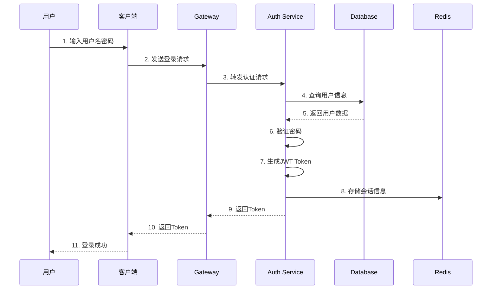
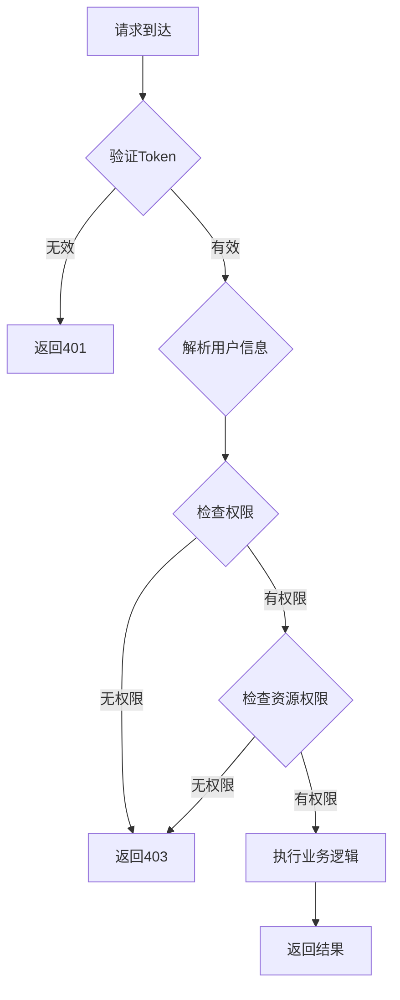

# Axiom MES 智能生产系统 - 认证授权机制文档

**文档版本**：1.0  
**最后更新**：2026-03-10  
**适用范围**：Axiom MES 智能生产系统认证授权机制  
**状态**：正式发布  

---

## 目录

1. [认证机制概述](#1-认证机制概述)
2. [OAuth2 认证流程](#2-oauth2-认证流程)
3. [JWT Token 设计](#3-jwt-token-设计)
4. [授权机制设计](#4-授权机制设计)
5. [RBAC 权限模型](#5-rbac-权限模型)
6. [会话管理](#6-会话管理)
7. [多因素认证](#7-多因素认证)
8. [安全最佳实践](#8-安全最佳实践)

---

## 1. 认证机制概述

### 1.1 认证方式

Axiom MES 系统支持以下认证方式：

| 认证方式 | 适用场景 | 安全级别 | 说明 |
|---------|---------|---------|------|
| 用户名密码 | 普通用户登录 | 中 | 基础认证方式 |
| OAuth2 | 第三方应用集成 | 高 | 标准授权协议 |
| JWT Token | API访问认证 | 高 | 无状态Token认证 |
| API Key | 服务间通信 | 高 | 服务身份认证 |
| 多因素认证 | 敏感操作 | 极高 | 多重身份验证 |

### 1.2 认证架构

```
┌─────────────────────────────────────────────────────────────┐
│                      认证架构图                              │
└─────────────────────────────────────────────────────────────┘

                    ┌─────────────┐
                    │   客户端    │
                    └─────────────┘
                          │
                          ▼
                    ┌─────────────┐
                    │   Traefik   │
                    │   Gateway   │
                    └─────────────┘
                          │
                          ▼
                    ┌─────────────┐
                    │  FastAPI    │
                    │  认证中间件 │
                    └─────────────┘
                          │
            ┌─────────────┼─────────────┐
            │             │             │
            ▼             ▼             ▼
      ┌──────────┐  ┌──────────┐  ┌──────────┐
      │  OAuth2  │  │   JWT    │  │ API Key  │
      │  认证    │  │  验证    │  │  验证    │
      └──────────┘  └──────────┘  └──────────┘
            │             │             │
            └─────────────┼─────────────┘
                          │
                          ▼
                    ┌─────────────┐
                    │  用户数据库 │
                    └─────────────┘
```

---

## 2. OAuth2 认证流程

### 2.1 OAuth2 密码模式

适用于受信任的第一方应用：

```python
from fastapi import FastAPI, Depends, HTTPException, status
from fastapi.security import OAuth2PasswordBearer, OAuth2PasswordRequestForm
from passlib.context import CryptContext
from datetime import datetime, timedelta
import jwt

app = FastAPI()

oauth2_scheme = OAuth2PasswordBearer(tokenUrl="token")
pwd_context = CryptContext(schemes=["bcrypt"], deprecated="auto")

SECRET_KEY = "your-secret-key"
ALGORITHM = "HS256"
ACCESS_TOKEN_EXPIRE_MINUTES = 30

def verify_password(plain_password: str, hashed_password: str) -> bool:
    return pwd_context.verify(plain_password, hashed_password)

def create_access_token(data: dict, expires_delta: timedelta = None):
    to_encode = data.copy()
    if expires_delta:
        expire = datetime.utcnow() + expires_delta
    else:
        expire = datetime.utcnow() + timedelta(minutes=15)
    to_encode.update({"exp": expire})
    encoded_jwt = jwt.encode(to_encode, SECRET_KEY, algorithm=ALGORITHM)
    return encoded_jwt

@app.post("/token")
async def login(form_data: OAuth2PasswordRequestForm = Depends()):
    user = authenticate_user(form_data.username, form_data.password)
    if not user:
        raise HTTPException(
            status_code=status.HTTP_401_UNAUTHORIZED,
            detail="Incorrect username or password",
            headers={"WWW-Authenticate": "Bearer"},
        )
    access_token_expires = timedelta(minutes=ACCESS_TOKEN_EXPIRE_MINUTES)
    access_token = create_access_token(
        data={"sub": user.username}, expires_delta=access_token_expires
    )
    return {"access_token": access_token, "token_type": "bearer"}
```

### 2.2 OAuth2 授权码模式

适用于第三方应用集成：

```
┌─────────────────────────────────────────────────────────────┐
│                  OAuth2 授权码流程                           │
└─────────────────────────────────────────────────────────────┘

用户 ──► 第三方应用 ──► 授权服务器 ──► 用户登录/授权
                                          │
                                          ▼
                                    返回授权码
                                          │
                                          ▼
第三方应用 ◄── 返回Access Token ◄── 授权服务器
     │
     ▼
访问受保护资源
```

### 2.3 刷新Token机制

```python
from datetime import datetime, timedelta
from typing import Optional

REFRESH_TOKEN_EXPIRE_DAYS = 7

def create_refresh_token(data: dict) -> str:
    to_encode = data.copy()
    expire = datetime.utcnow() + timedelta(days=REFRESH_TOKEN_EXPIRE_DAYS)
    to_encode.update({"exp": expire, "type": "refresh"})
    encoded_jwt = jwt.encode(to_encode, SECRET_KEY, algorithm=ALGORITHM)
    return encoded_jwt

@app.post("/refresh")
async def refresh_token(refresh_token: str):
    try:
        payload = jwt.decode(refresh_token, SECRET_KEY, algorithms=[ALGORITHM])
        if payload.get("type") != "refresh":
            raise HTTPException(status_code=401, detail="Invalid token type")
        
        username = payload.get("sub")
        new_access_token = create_access_token(data={"sub": username})
        return {"access_token": new_access_token, "token_type": "bearer"}
    except jwt.ExpiredSignatureError:
        raise HTTPException(status_code=401, detail="Token has expired")
    except jwt.JWTError:
        raise HTTPException(status_code=401, detail="Invalid token")
```

---

## 3. JWT Token 设计

### 3.1 Token 结构

```
┌─────────────────────────────────────────────────────────────┐
│                      JWT Token 结构                          │
└─────────────────────────────────────────────────────────────┘

Header (Base64编码)
{
  "alg": "HS256",
  "typ": "JWT"
}

Payload (Base64编码)
{
  "sub": "user_id",
  "username": "john_doe",
  "roles": ["admin", "operator"],
  "permissions": ["read", "write", "delete"],
  "exp": 1234567890,
  "iat": 1234560000,
  "jti": "unique_token_id"
}

Signature (签名)
HMACSHA256(
  base64UrlEncode(header) + "." + base64UrlEncode(payload),
  secret
)
```

### 3.2 Token Payload 设计

```python
from pydantic import BaseModel
from typing import List, Optional
from datetime import datetime

class TokenPayload(BaseModel):
    sub: str
    username: str
    roles: List[str] = []
    permissions: List[str] = []
    exp: datetime
    iat: datetime
    jti: str
    iss: Optional[str] = None
    aud: Optional[str] = None

class TokenData(BaseModel):
    user_id: str
    username: str
    roles: List[str] = []
    permissions: List[str] = []
```

### 3.3 Token 验证中间件

```python
from fastapi import Request, HTTPException, status
from fastapi.security import HTTPBearer, HTTPAuthorizationCredentials
import jwt

security = HTTPBearer()

async def get_current_user(
    credentials: HTTPAuthorizationCredentials = Depends(security)
) -> TokenData:
    token = credentials.credentials
    
    try:
        payload = jwt.decode(token, SECRET_KEY, algorithms=[ALGORITHM])
        token_data = TokenData(
            user_id=payload.get("sub"),
            username=payload.get("username"),
            roles=payload.get("roles", []),
            permissions=payload.get("permissions", [])
        )
        return token_data
    except jwt.ExpiredSignatureError:
        raise HTTPException(
            status_code=status.HTTP_401_UNAUTHORIZED,
            detail="Token has expired"
        )
    except jwt.JWTError:
        raise HTTPException(
            status_code=status.HTTP_401_UNAUTHORIZED,
            detail="Invalid token"
        )
```

### 3.4 Token 黑名单机制

```python
import redis
from typing import Optional

redis_client = redis.Redis(host='localhost', port=6379, db=0)

def add_token_to_blacklist(token: str, expires_in: int) -> bool:
    key = f"blacklist:{token}"
    return redis_client.setex(key, expires_in, "1")

def is_token_blacklisted(token: str) -> bool:
    key = f"blacklist:{token}"
    return redis_client.exists(key)

@app.post("/logout")
async def logout(
    credentials: HTTPAuthorizationCredentials = Depends(security)
):
    token = credentials.credentials
    payload = jwt.decode(token, SECRET_KEY, algorithms=[ALGORITHM])
    exp = payload.get("exp")
    expires_in = exp - datetime.utcnow().timestamp()
    
    if expires_in > 0:
        add_token_to_blacklist(token, int(expires_in))
    
    return {"message": "Successfully logged out"}
```

---

## 4. 授权机制设计

### 4.1 授权模型

```
┌─────────────────────────────────────────────────────────────┐
│                      授权模型架构                            │
└─────────────────────────────────────────────────────────────┘

用户 (User)
    │
    ├─── 拥有 ───► 角色 (Role)
    │                  │
    │                  └─── 包含 ───► 权限 (Permission)
    │                                    │
    │                                    └─── 对应 ───► 资源 (Resource)
    │
    └─── 直接权限 ──────────────────────────────────► 资源
```

### 4.2 权限检查流程

```python
from functools import wraps
from typing import List, Callable

def require_permissions(required_permissions: List[str]):
    def decorator(func: Callable):
        @wraps(func)
        async def wrapper(*args, current_user: TokenData = Depends(get_current_user), **kwargs):
            user_permissions = set(current_user.permissions)
            required = set(required_permissions)
            
            if not required.issubset(user_permissions):
                missing = required - user_permissions
                raise HTTPException(
                    status_code=status.HTTP_403_FORBIDDEN,
                    detail=f"Missing permissions: {missing}"
                )
            
            return await func(*args, current_user=current_user, **kwargs)
        return wrapper
    return decorator

def require_roles(required_roles: List[str]):
    def decorator(func: Callable):
        @wraps(func)
        async def wrapper(*args, current_user: TokenData = Depends(get_current_user), **kwargs):
            user_roles = set(current_user.roles)
            required = set(required_roles)
            
            if not required.intersection(user_roles):
                raise HTTPException(
                    status_code=status.HTTP_403_FORBIDDEN,
                    detail=f"Required roles: {required}"
                )
            
            return await func(*args, current_user=current_user, **kwargs)
        return wrapper
    return decorator
```

### 4.3 资源级权限控制

```python
from enum import Enum

class ResourceType(str, Enum):
    STRATEGY = "strategy"
    SCHEDULE = "schedule"
    QUALITY = "quality"
    EMPLOYEE = "employee"
    REPORT = "report"

class Permission(str, Enum):
    CREATE = "create"
    READ = "read"
    UPDATE = "update"
    DELETE = "delete"
    EXECUTE = "execute"

def check_resource_permission(
    user: TokenData,
    resource: ResourceType,
    permission: Permission
) -> bool:
    required_permission = f"{resource.value}:{permission.value}"
    return required_permission in user.permissions

@app.get("/strategies/{strategy_id}")
async def get_strategy(
    strategy_id: int,
    current_user: TokenData = Depends(get_current_user)
):
    if not check_resource_permission(current_user, ResourceType.STRATEGY, Permission.READ):
        raise HTTPException(
            status_code=status.HTTP_403_FORBIDDEN,
            detail="No permission to read strategies"
        )
    
    return {"strategy_id": strategy_id, "name": "Strategy Name"}
```

---

## 5. RBAC 权限模型

### 5.1 角色定义

| 角色名称 | 角色代码 | 描述 | 权限范围 |
|---------|---------|------|---------|
| 超级管理员 | super_admin | 系统最高权限 | 所有权限 |
| 系统管理员 | admin | 系统管理权限 | 用户管理、配置管理、日志查看 |
| 生产经理 | production_manager | 生产管理权限 | 策略管理、排程管理、报表查看 |
| 质量管理员 | quality_manager | 质量管理权限 | 质量检测、质量报表 |
| 操作员 | operator | 基础操作权限 | 数据录入、状态查看 |
| 查看者 | viewer | 只读权限 | 数据查看 |

### 5.2 权限矩阵

| 资源 | 超级管理员 | 系统管理员 | 生产经理 | 质量管理员 | 操作员 | 查看者 |
|------|-----------|-----------|---------|-----------|--------|--------|
| 用户管理 | ✓ | ✓ | ✗ | ✗ | ✗ | ✗ |
| 策略管理 | ✓ | ✓ | ✓ | ✗ | ✗ | 查看 |
| 排程管理 | ✓ | ✓ | ✓ | ✗ | 执行 | 查看 |
| 质量管理 | ✓ | ✓ | ✗ | ✓ | 录入 | 查看 |
| 报表查看 | ✓ | ✓ | ✓ | ✓ | ✗ | 查看 |
| 系统配置 | ✓ | ✓ | ✗ | ✗ | ✗ | ✗ |

### 5.3 数据库模型

```python
from sqlalchemy import Column, Integer, String, Boolean, DateTime, ForeignKey, Table
from sqlalchemy.orm import relationship
from datetime import datetime
from database import Base

user_role = Table(
    'user_role',
    Base.metadata,
    Column('user_id', Integer, ForeignKey('users.id'), primary_key=True),
    Column('role_id', Integer, ForeignKey('roles.id'), primary_key=True)
)

role_permission = Table(
    'role_permission',
    Base.metadata,
    Column('role_id', Integer, ForeignKey('roles.id'), primary_key=True),
    Column('permission_id', Integer, ForeignKey('permissions.id'), primary_key=True)
)

class User(Base):
    __tablename__ = "users"
    
    id = Column(Integer, primary_key=True, index=True)
    username = Column(String(50), unique=True, index=True, nullable=False)
    email = Column(String(100), unique=True, index=True, nullable=False)
    hashed_password = Column(String(255), nullable=False)
    is_active = Column(Boolean, default=True)
    is_superuser = Column(Boolean, default=False)
    created_at = Column(DateTime, default=datetime.utcnow)
    updated_at = Column(DateTime, default=datetime.utcnow, onupdate=datetime.utcnow)
    
    roles = relationship("Role", secondary=user_role, back_populates="users")

class Role(Base):
    __tablename__ = "roles"
    
    id = Column(Integer, primary_key=True, index=True)
    name = Column(String(50), unique=True, index=True, nullable=False)
    code = Column(String(50), unique=True, index=True, nullable=False)
    description = Column(String(255))
    is_active = Column(Boolean, default=True)
    created_at = Column(DateTime, default=datetime.utcnow)
    
    users = relationship("User", secondary=user_role, back_populates="roles")
    permissions = relationship("Permission", secondary=role_permission, back_populates="roles")

class Permission(Base):
    __tablename__ = "permissions"
    
    id = Column(Integer, primary_key=True, index=True)
    name = Column(String(100), unique=True, index=True, nullable=False)
    code = Column(String(100), unique=True, index=True, nullable=False)
    resource = Column(String(50), nullable=False)
    action = Column(String(50), nullable=False)
    description = Column(String(255))
    created_at = Column(DateTime, default=datetime.utcnow)
    
    roles = relationship("Role", secondary=role_permission, back_populates="permissions")
```

---

## 6. 会话管理

### 6.1 会话配置

```python
from pydantic import BaseSettings

class SessionSettings(BaseSettings):
    ACCESS_TOKEN_EXPIRE_MINUTES: int = 30
    REFRESH_TOKEN_EXPIRE_DAYS: int = 7
    MAX_CONCURRENT_SESSIONS: int = 5
    SESSION_CLEANUP_INTERVAL: int = 3600
    
    class Config:
        env_prefix = "SESSION_"
```

### 6.2 会话存储

```python
import redis
import json
from typing import Optional, Dict

class SessionManager:
    def __init__(self, redis_client: redis.Redis):
        self.redis = redis_client
        self.prefix = "session:"
    
    def create_session(self, user_id: str, token: str, expires_in: int) -> bool:
        session_key = f"{self.prefix}{user_id}:{token}"
        session_data = {
            "user_id": user_id,
            "token": token,
            "created_at": datetime.utcnow().isoformat()
        }
        return self.redis.setex(session_key, expires_in, json.dumps(session_data))
    
    def get_session(self, user_id: str, token: str) -> Optional[Dict]:
        session_key = f"{self.prefix}{user_id}:{token}"
        session_data = self.redis.get(session_key)
        return json.loads(session_data) if session_data else None
    
    def delete_session(self, user_id: str, token: str) -> bool:
        session_key = f"{self.prefix}{user_id}:{token}"
        return self.redis.delete(session_key) > 0
    
    def get_user_sessions(self, user_id: str) -> list:
        pattern = f"{self.prefix}{user_id}:*"
        keys = self.redis.keys(pattern)
        sessions = []
        for key in keys:
            session_data = self.redis.get(key)
            if session_data:
                sessions.append(json.loads(session_data))
        return sessions
    
    def cleanup_expired_sessions(self, user_id: str, max_sessions: int = 5):
        sessions = self.get_user_sessions(user_id)
        if len(sessions) > max_sessions:
            sessions.sort(key=lambda x: x["created_at"])
            for session in sessions[:-max_sessions]:
                self.delete_session(user_id, session["token"])
```

### 6.3 并发会话控制

```python
from fastapi import HTTPException, status

async def check_concurrent_sessions(
    user_id: str,
    session_manager: SessionManager,
    max_sessions: int = 5
):
    sessions = session_manager.get_user_sessions(user_id)
    if len(sessions) >= max_sessions:
        session_manager.cleanup_expired_sessions(user_id, max_sessions)
        
        sessions = session_manager.get_user_sessions(user_id)
        if len(sessions) >= max_sessions:
            raise HTTPException(
                status_code=status.HTTP_429_TOO_MANY_REQUESTS,
                detail=f"Maximum concurrent sessions ({max_sessions}) reached"
            )
```

---

## 7. 多因素认证

### 7.1 MFA 架构

```
┌─────────────────────────────────────────────────────────────┐
│                    多因素认证流程                            │
└─────────────────────────────────────────────────────────────┘

用户登录
    │
    ▼
第一因素：密码验证
    │
    ├─ 失败 ──► 拒绝登录
    │
    ▼
第二因素选择
    │
    ├─► 短信验证码
    ├─► 邮箱验证码
    ├─► TOTP (时间令牌)
    └─► 硬件令牌
    │
    ▼
验证第二因素
    │
    ├─ 失败 ──► 拒绝登录
    │
    ▼
登录成功
```

### 7.2 TOTP 实现

```python
import pyotp
import qrcode
from io import BytesIO
import base64

class MFAService:
    def __init__(self, secret_key: str):
        self.secret_key = secret_key
    
    def generate_totp_secret(self, user_id: str) -> str:
        return pyotp.random_base32()
    
    def get_totp_uri(self, user_id: str, secret: str, issuer: str = "AxiomMES") -> str:
        totp = pyotp.TOTP(secret)
        return totp.provisioning_uri(name=user_id, issuer_name=issuer)
    
    def generate_qr_code(self, uri: str) -> str:
        qr = qrcode.QRCode(version=1, box_size=10, border=5)
        qr.add_data(uri)
        qr.make(fit=True)
        
        img = qr.make_image(fill_color="black", back_color="white")
        buffered = BytesIO()
        img.save(buffered, format="PNG")
        
        return base64.b64encode(buffered.getvalue()).decode()
    
    def verify_totp(self, secret: str, code: str) -> bool:
        totp = pyotp.TOTP(secret)
        return totp.verify(code, valid_window=1)
```

### 7.3 短信验证码

```python
import random
import string
from datetime import datetime, timedelta

class SMSMFAService:
    def __init__(self, redis_client: redis.Redis):
        self.redis = redis_client
        self.prefix = "sms_mfa:"
        self.code_length = 6
        self.expire_minutes = 5
    
    def generate_code(self) -> str:
        return ''.join(random.choices(string.digits, k=self.code_length))
    
    def send_code(self, phone: str) -> str:
        code = self.generate_code()
        key = f"{self.prefix}{phone}"
        
        self.redis.setex(key, timedelta(minutes=self.expire_minutes), code)
        
        # 这里调用短信服务发送验证码
        # sms_service.send(phone, f"您的验证码是：{code}，有效期{self.expire_minutes}分钟")
        
        return code
    
    def verify_code(self, phone: str, code: str) -> bool:
        key = f"{self.prefix}{phone}"
        stored_code = self.redis.get(key)
        
        if stored_code and stored_code.decode() == code:
            self.redis.delete(key)
            return True
        
        return False
```

---

## 8. 安全最佳实践

### 8.1 密码安全

| 安全措施 | 实现方式 | 说明 |
|---------|---------|------|
| 密码哈希 | bcrypt | 加盐哈希，防止彩虹表攻击 |
| 密码强度 | 正则校验 | 至少8位，包含大小写字母、数字、特殊字符 |
| 密码历史 | 记录历史 | 防止重复使用最近5次密码 |
| 密码过期 | 定期提醒 | 90天提醒修改，不强制 |
| 登录失败锁定 | 5次锁定 | 5次失败后锁定账户30分钟 |

### 8.2 Token 安全

| 安全措施 | 实现方式 | 说明 |
|---------|---------|------|
| 短有效期 | 30分钟 | Access Token 有效期短 |
| 刷新机制 | Refresh Token | 7天有效期，可刷新 |
| 黑名单 | Redis | 登出后加入黑名单 |
| HTTPS传输 | TLS 1.3 | 防止中间人攻击 |
| 安全存储 | HttpOnly Cookie | 防止XSS窃取 |

### 8.3 会话安全

| 安全措施 | 实现方式 | 说明 |
|---------|---------|------|
| 会话超时 | 30分钟无操作 | 自动登出 |
| 并发控制 | 最多5个会话 | 防止会话共享 |
| IP绑定 | 可选 | 高安全场景绑定IP |
| 设备指纹 | 可选 | 识别异常设备 |
| 会话审计 | 记录日志 | 追踪会话活动 |

### 8.4 安全配置清单

- [ ] 启用HTTPS
- [ ] 配置CORS白名单
- [ ] 启用限流保护
- [ ] 配置密码策略
- [ ] 启用登录失败锁定
- [ ] 配置Token有效期
- [ ] 启用审计日志
- [ ] 配置MFA（可选）
- [ ] 启用会话管理
- [ ] 配置安全响应头

---

## 附录

### A. 认证流程图



### B. 权限检查流程图



---

**文档维护**：MES 系统架构组  
**联系方式**：[363679401@qq.com](mailto:363679401@qq.com)  
**最后更新**：2026-03-10
