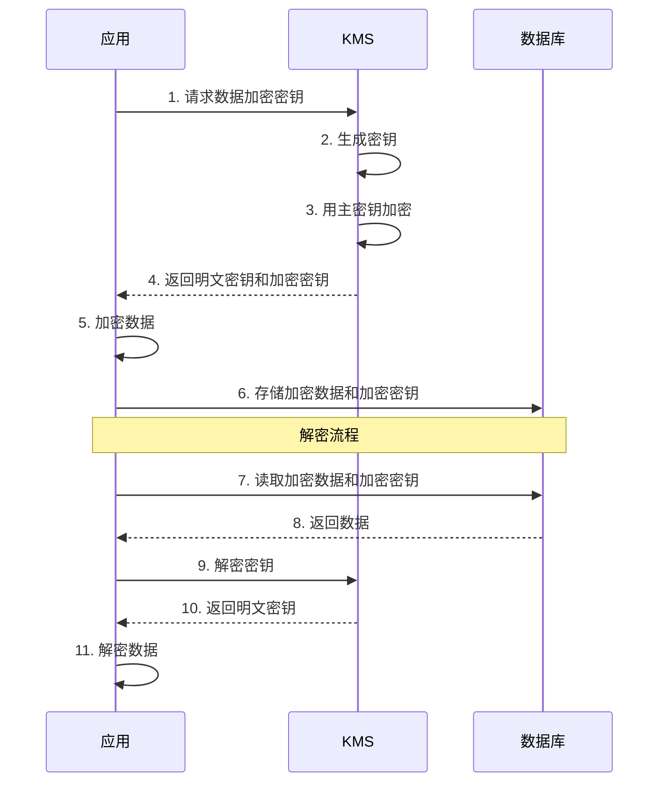
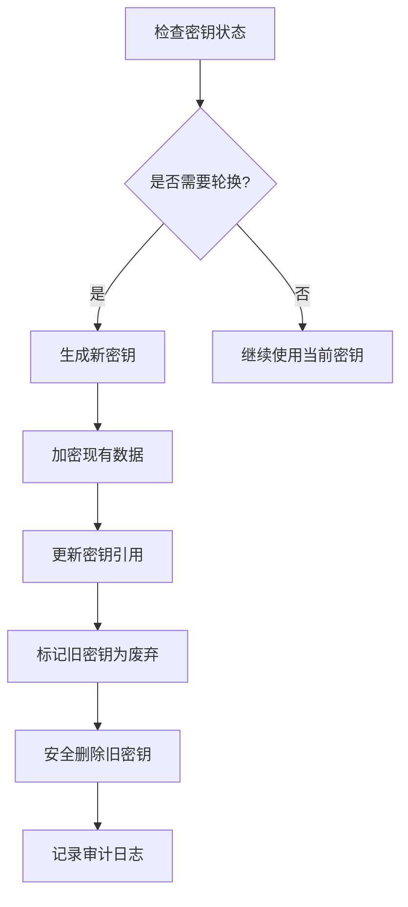

# Axiom MES 智能生产系统 - 数据加密文档

**文档版本**：1.0  
**最后更新**：2026-03-10  
**适用范围**：Axiom MES 智能生产系统数据加密机制  
**状态**：正式发布  

---

## 目录

1. [加密机制概述](#1-加密机制概述)
2. [传输加密](#2-传输加密)
3. [存储加密](#3-存储加密)
4. [敏感数据加密](#4-敏感数据加密)
5. [密钥管理](#5-密钥管理)
6. [加密算法选择](#6-加密算法选择)
7. [加密最佳实践](#7-加密最佳实践)

---

## 1. 加密机制概述

### 1.1 加密目标

Axiom MES 系统数据加密旨在实现：

- **传输安全**：数据在网络传输过程中不被窃取或篡改
- **存储安全**：数据在存储时被加密保护
- **敏感数据保护**：敏感字段单独加密
- **密钥安全**：密钥安全存储和轮换

### 1.2 加密层次架构

```
┌─────────────────────────────────────────────────────────────┐
│                      加密层次架构                            │
└─────────────────────────────────────────────────────────────┘

┌─────────────────────────────────────────────────────────────┐
│  应用层加密                                                  │
│  敏感字段加密 │ 密码哈希 │ 数据脱敏                         │
├─────────────────────────────────────────────────────────────┤
│  传输层加密                                                  │
│  TLS 1.3 │ mTLS │ 证书管理                                   │
├─────────────────────────────────────────────────────────────┤
│  存储层加密                                                  │
│  数据库TDE │ 磁盘加密 │ 备份加密                             │
├─────────────────────────────────────────────────────────────┤
│  密钥管理层                                                  │
│  KMS │ 密钥轮换 │ 密钥备份                                   │
└─────────────────────────────────────────────────────────────┘
```

### 1.3 数据分类与加密策略

| 数据级别 | 数据类型 | 传输加密 | 存储加密 | 字段加密 |
|---------|---------|---------|---------|---------|
| 绝密 | 密钥、证书、密码 | TLS 1.3 | AES-256 | AES-256-GCM |
| 机密 | 身份证、手机号、财务数据 | TLS 1.3 | AES-256 | AES-256-GCM |
| 内部 | 业务数据、配置信息 | TLS 1.3 | AES-128 | 可选 |
| 公开 | 公告、帮助文档 | TLS 1.3 | 无 | 无 |

---

## 2. 传输加密

### 2.1 TLS 配置

```yaml
# Traefik TLS 配置
tls:
  certificates:
    - certFile: /etc/traefik/certs/cert.pem
      keyFile: /etc/traefik/certs/key.pem
  
  options:
    default:
      minVersion: VersionTLS13
      cipherSuites:
        - TLS_AES_256_GCM_SHA384
        - TLS_CHACHA20_POLY1305_SHA256
        - TLS_AES_128_GCM_SHA256
      curvePreferences:
        - CurveP521
        - CurveP384
```

### 2.2 证书管理

```python
from cryptography import x509
from cryptography.x509.oid import NameOID
from cryptography.hazmat.primitives import hashes
from cryptography.hazmat.primitives.asymmetric import rsa
from cryptography.hazmat.primitives import serialization
from datetime import datetime, timedelta

class CertificateManager:
    def generate_self_signed_cert(
        self,
        common_name: str,
        organization: str,
        validity_days: int = 365
    ) -> tuple:
        private_key = rsa.generate_private_key(
            public_exponent=65537,
            key_size=2048
        )
        
        subject = issuer = x509.Name([
            x509.NameAttribute(NameOID.COUNTRY_NAME, "CN"),
            x509.NameAttribute(NameOID.STATE_OR_PROVINCE_NAME, "Beijing"),
            x509.NameAttribute(NameOID.LOCALITY_NAME, "Beijing"),
            x509.NameAttribute(NameOID.ORGANIZATION_NAME, organization),
            x509.NameAttribute(NameOID.COMMON_NAME, common_name),
        ])
        
        cert = x509.CertificateBuilder().subject_name(
            subject
        ).issuer_name(
            issuer
        ).public_key(
            private_key.public_key()
        ).serial_number(
            x509.random_serial_number()
        ).not_valid_before(
            datetime.utcnow()
        ).not_valid_after(
            datetime.utcnow() + timedelta(days=validity_days)
        ).add_extension(
            x509.SubjectAlternativeName([
                x509.DNSName(common_name),
            ]),
            critical=False,
        ).sign(private_key, hashes.SHA256())
        
        return cert, private_key
    
    def save_certificate(self, cert, private_key, cert_path: str, key_path: str):
        with open(cert_path, "wb") as f:
            f.write(cert.public_bytes(serialization.Encoding.PEM))
        
        with open(key_path, "wb") as f:
            f.write(private_key.private_bytes(
                encoding=serialization.Encoding.PEM,
                format=serialization.PrivateFormat.PKCS8,
                encryption_algorithm=serialization.NoEncryption()
            ))
```

### 2.3 mTLS 配置

```yaml
# Traefik mTLS 配置
http:
  middlewares:
    mtls-auth:
      plugin:
        mtls:
          caCert: /etc/traefik/certs/ca.pem
          clientCert: /etc/traefik/certs/client.pem
```

---

## 3. 存储加密

### 3.1 数据库透明加密（TDE）

```sql
-- PostgreSQL 透明数据加密配置
-- 注意：PostgreSQL 原生不支持 TDE，需要使用扩展或文件系统加密

-- 使用 pgcrypto 扩展进行字段加密
CREATE EXTENSION IF NOT EXISTS pgcrypto;

-- 创建加密函数
CREATE OR REPLACE FUNCTION encrypt_data(data text, key text)
RETURNS text AS $$
BEGIN
    RETURN encode(
        pgp_sym_encrypt(data, key, 'cipher-algo=aes256'),
        'base64'
    );
END;
$$ LANGUAGE plpgsql;

-- 创建解密函数
CREATE OR REPLACE FUNCTION decrypt_data(encrypted_data text, key text)
RETURNS text AS $$
BEGIN
    RETURN pgp_sym_decrypt(
        decode(encrypted_data, 'base64'),
        key
    );
END;
$$ LANGUAGE plpgsql;
```

### 3.2 磁盘加密

```bash
# Linux LUKS 磁盘加密
cryptsetup luksFormat /dev/sdb1
cryptsetup luksOpen /dev/sdb1 encrypted_disk
mkfs.ext4 /dev/mapper/encrypted_disk
mount /dev/mapper/encrypted_disk /mnt/encrypted
```

### 3.3 备份加密

```python
from cryptography.fernet import Fernet
import gzip
import shutil
from pathlib import Path

class BackupEncryption:
    def __init__(self, key: bytes):
        self.fernet = Fernet(key)
    
    def encrypt_backup(self, source_path: str, dest_path: str):
        with open(source_path, 'rb') as f:
            data = f.read()
        
        compressed = gzip.compress(data)
        encrypted = self.fernet.encrypt(compressed)
        
        with open(dest_path, 'wb') as f:
            f.write(encrypted)
    
    def decrypt_backup(self, source_path: str, dest_path: str):
        with open(source_path, 'rb') as f:
            encrypted = f.read()
        
        decrypted = self.fernet.decrypt(encrypted)
        decompressed = gzip.decompress(decrypted)
        
        with open(dest_path, 'wb') as f:
            f.write(decompressed)
```

---

## 4. 敏感数据加密

### 4.1 字段加密服务

```python
from cryptography.hazmat.primitives.ciphers.aead import AESGCM
from cryptography.hazmat.primitives import hashes
from cryptography.hazmat.primitives.kdf.pbkdf2 import PBKDF2HMAC
from cryptography.hazmat.backends import default_backend
import os
import base64
from typing import Optional

class FieldEncryption:
    def __init__(self, master_key: bytes):
        self.master_key = master_key
        self.aesgcm = AESGCM(master_key)
    
    def encrypt(self, plaintext: str, associated_data: Optional[bytes] = None) -> str:
        nonce = os.urandom(12)
        
        if isinstance(plaintext, str):
            plaintext = plaintext.encode('utf-8')
        
        ciphertext = self.aesgcm.encrypt(
            nonce,
            plaintext,
            associated_data
        )
        
        encrypted = nonce + ciphertext
        return base64.b64encode(encrypted).decode('utf-8')
    
    def decrypt(self, encrypted_text: str, associated_data: Optional[bytes] = None) -> str:
        encrypted = base64.b64decode(encrypted_text.encode('utf-8'))
        
        nonce = encrypted[:12]
        ciphertext = encrypted[12:]
        
        plaintext = self.aesgcm.decrypt(
            nonce,
            ciphertext,
            associated_data
        )
        
        return plaintext.decode('utf-8')
```

### 4.2 敏感字段加密示例

```python
from sqlalchemy import Column, Integer, String, TypeDecorator
from sqlalchemy.ext.declarative import declarative_base

Base = declarative_base()

class EncryptedString(TypeDecorator):
    impl = String
    cache_ok = True
    
    def __init__(self, encryption_service: FieldEncryption, *args, **kwargs):
        self.encryption_service = encryption_service
        super().__init__(*args, **kwargs)
    
    def process_bind_param(self, value, dialect):
        if value is not None:
            return self.encryption_service.encrypt(value)
        return value
    
    def process_result_value(self, value, dialect):
        if value is not None:
            return self.encryption_service.decrypt(value)
        return value

class User(Base):
    __tablename__ = "users"
    
    id = Column(Integer, primary_key=True, index=True)
    username = Column(String(50), unique=True, index=True)
    email = Column(String(100), unique=True, index=True)
    phone = Column(EncryptedString(encryption_service), nullable=True)
    id_card = Column(EncryptedString(encryption_service), nullable=True)
```

### 4.3 数据脱敏

```python
import re
from typing import Optional

class DataMasker:
    @staticmethod
    def mask_phone(phone: str) -> str:
        if not phone or len(phone) < 7:
            return phone
        return phone[:3] + '****' + phone[-4:]
    
    @staticmethod
    def mask_id_card(id_card: str) -> str:
        if not id_card or len(id_card) < 8:
            return id_card
        return id_card[:4] + '**********' + id_card[-4:]
    
    @staticmethod
    def mask_email(email: str) -> str:
        if not email or '@' not in email:
            return email
        parts = email.split('@')
        username = parts[0]
        domain = parts[1]
        
        if len(username) <= 2:
            masked_username = username[0] + '*'
        else:
            masked_username = username[0] + '*' * (len(username) - 2) + username[-1]
        
        return masked_username + '@' + domain
    
    @staticmethod
    def mask_bank_card(card_number: str) -> str:
        if not card_number or len(card_number) < 8:
            return card_number
        return card_number[:4] + ' **** **** ' + card_number[-4:]
```

---

## 5. 密钥管理

### 5.1 密钥层次结构

```
┌─────────────────────────────────────────────────────────────┐
│                      密钥层次结构                            │
└─────────────────────────────────────────────────────────────┘

┌─────────────┐
│  主密钥     │ ──── 由KMS管理，永不离线
│  (Master)   │
└─────────────┘
      │
      ├──────► 数据加密密钥 (DEK)
      │        用于加密业务数据
      │
      ├──────► 密钥加密密钥 (KEK)
      │        用于加密数据加密密钥
      │
      └──────► 会话密钥 (Session Key)
               用于临时会话加密
```

### 5.2 密钥管理服务

```python
from cryptography.hazmat.primitives.asymmetric import rsa, padding
from cryptography.hazmat.primitives import hashes, serialization
from cryptography.hazmat.primitives.ciphers import Cipher, algorithms, modes
import os
from datetime import datetime, timedelta
from typing import Dict, Optional
import json

class KeyManagementService:
    def __init__(self):
        self.master_key = None
        self.key_store: Dict[str, dict] = {}
    
    def generate_master_key(self) -> bytes:
        return os.urandom(32)
    
    def generate_data_key(self, key_id: str) -> tuple:
        data_key = os.urandom(32)
        
        encrypted_key = self._encrypt_key(data_key)
        
        self.key_store[key_id] = {
            "encrypted_key": encrypted_key,
            "created_at": datetime.utcnow().isoformat(),
            "expires_at": (datetime.utcnow() + timedelta(days=90)).isoformat()
        }
        
        return data_key, encrypted_key
    
    def decrypt_data_key(self, key_id: str) -> bytes:
        key_info = self.key_store.get(key_id)
        if not key_info:
            raise ValueError(f"Key {key_id} not found")
        
        expires_at = datetime.fromisoformat(key_info["expires_at"])
        if datetime.utcnow() > expires_at:
            raise ValueError(f"Key {key_id} has expired")
        
        return self._decrypt_key(key_info["encrypted_key"])
    
    def rotate_key(self, key_id: str) -> tuple:
        old_key_info = self.key_store.get(key_id)
        if old_key_info:
            old_key_info["status"] = "deprecated"
        
        return self.generate_data_key(key_id)
    
    def _encrypt_key(self, key: bytes) -> bytes:
        cipher = Cipher(algorithms.AES(self.master_key), modes.GCM(os.urandom(12)))
        encryptor = cipher.encryptor()
        encrypted = encryptor.update(key) + encryptor.finalize()
        return encryptor.nonce + encrypted + encryptor.tag
    
    def _decrypt_key(self, encrypted_key: bytes) -> bytes:
        nonce = encrypted_key[:12]
        tag = encrypted_key[-16:]
        ciphertext = encrypted_key[12:-16]
        
        cipher = Cipher(algorithms.AES(self.master_key), modes.GCM(nonce, tag))
        decryptor = cipher.decryptor()
        return decryptor.update(ciphertext) + decryptor.finalize()
```

### 5.3 密钥轮换策略

```python
from enum import Enum
from datetime import datetime, timedelta

class KeyStatus(str, Enum):
    ACTIVE = "active"
    DEPRECATED = "deprecated"
    REVOKED = "revoked"

class KeyRotationPolicy:
    def __init__(self, rotation_days: int = 90):
        self.rotation_days = rotation_days
        self.warning_days = 14
    
    def should_rotate(self, created_at: datetime) -> bool:
        rotation_date = created_at + timedelta(days=self.rotation_days)
        return datetime.utcnow() >= rotation_date
    
    def should_warn(self, created_at: datetime) -> bool:
        warning_date = created_at + timedelta(days=self.rotation_days - self.warning_days)
        rotation_date = created_at + timedelta(days=self.rotation_days)
        return warning_date <= datetime.utcnow() < rotation_date
    
    def get_rotation_status(self, created_at: datetime) -> dict:
        rotation_date = created_at + timedelta(days=self.rotation_days)
        days_until_rotation = (rotation_date - datetime.utcnow()).days
        
        return {
            "should_rotate": self.should_rotate(created_at),
            "should_warn": self.should_warn(created_at),
            "days_until_rotation": max(0, days_until_rotation),
            "rotation_date": rotation_date.isoformat()
        }
```

---

## 6. 加密算法选择

### 6.1 对称加密算法

| 算法 | 密钥长度 | 模式 | 适用场景 | 安全性 |
|------|---------|------|---------|--------|
| AES-256-GCM | 256位 | GCM | 数据加密、字段加密 | 高 |
| AES-256-CBC | 256位 | CBC | 文件加密 | 中 |
| ChaCha20-Poly1305 | 256位 | Poly1305 | 移动设备、嵌入式 | 高 |

### 6.2 非对称加密算法

| 算法 | 密钥长度 | 适用场景 | 安全性 |
|------|---------|---------|--------|
| RSA-2048 | 2048位 | 密钥交换、数字签名 | 高 |
| RSA-4096 | 4096位 | 高安全场景 | 极高 |
| ECDSA-P256 | 256位 | 数字签名 | 高 |
| ECDSA-P384 | 384位 | 高安全签名 | 极高 |

### 6.3 哈希算法

| 算法 | 输出长度 | 适用场景 | 安全性 |
|------|---------|---------|--------|
| SHA-256 | 256位 | 数据完整性、数字签名 | 高 |
| SHA-384 | 384位 | 高安全场景 | 极高 |
| SHA-512 | 512位 | 高安全场景 | 极高 |
| bcrypt | 可变 | 密码哈希 | 极高 |
| Argon2 | 可变 | 密码哈希 | 极高 |

### 6.4 算法选择建议

```python
from enum import Enum

class EncryptionAlgorithm(str, Enum):
    AES_256_GCM = "AES-256-GCM"
    AES_256_CBC = "AES-256-CBC"
    CHACHA20_POLY1305 = "ChaCha20-Poly1305"

class HashAlgorithm(str, Enum):
    SHA_256 = "SHA-256"
    SHA_384 = "SHA-384"
    SHA_512 = "SHA-512"
    BCRYPT = "bcrypt"
    ARGON2 = "argon2"

class KeyExchangeAlgorithm(str, Enum):
    RSA_2048 = "RSA-2048"
    RSA_4096 = "RSA-4096"
    ECDH_P256 = "ECDH-P256"
    ECDH_P384 = "ECDH-P384"

ALGORITHM_RECOMMENDATIONS = {
    "data_encryption": EncryptionAlgorithm.AES_256_GCM,
    "password_hashing": HashAlgorithm.BCRYPT,
    "integrity_check": HashAlgorithm.SHA_256,
    "key_exchange": KeyExchangeAlgorithm.ECDH_P256,
    "digital_signature": "ECDSA-P256"
}
```

---

## 7. 加密最佳实践

### 7.1 加密配置清单

- [ ] 启用 TLS 1.3
- [ ] 配置强密码套件
- [ ] 启用证书验证
- [ ] 配置数据库加密
- [ ] 启用备份加密
- [ ] 敏感字段加密
- [ ] 配置密钥管理
- [ ] 启用密钥轮换
- [ ] 配置数据脱敏
- [ ] 定期安全审计

### 7.2 加密性能优化

| 优化措施 | 说明 | 预期效果 |
|---------|------|---------|
| 硬件加速 | 使用 AES-NI 指令集 | 性能提升 10-20 倍 |
| 批量加密 | 批量处理数据 | 减少加密开销 |
| 缓存密钥 | 缓存解密后的密钥 | 减少密钥解密次数 |
| 选择合适算法 | 根据场景选择算法 | 平衡安全与性能 |

### 7.3 加密安全检查

```python
class EncryptionSecurityChecker:
    @staticmethod
    def check_key_length(key: bytes, min_length: int = 32) -> bool:
        return len(key) >= min_length
    
    @staticmethod
    def check_iv_uniqueness(iv: bytes, used_ivs: set) -> bool:
        return iv not in used_ivs
    
    @staticmethod
    def check_algorithm_strength(algorithm: str) -> bool:
        weak_algorithms = ["DES", "3DES", "RC4", "MD5", "SHA1"]
        return not any(weak in algorithm.upper() for weak in weak_algorithms)
    
    @staticmethod
    def check_certificate_validity(cert_path: str) -> dict:
        from cryptography import x509
        from datetime import datetime
        
        with open(cert_path, 'rb') as f:
            cert = x509.load_pem_x509_certificate(f.read())
        
        return {
            "is_valid": cert.not_valid_after > datetime.utcnow(),
            "expires_at": cert.not_valid_after.isoformat(),
            "issuer": cert.issuer.rfc4514_string()
        }
```

### 7.4 加密审计日志

| 审计事件 | 日志级别 | 存储位置 | 保留时间 |
|---------|---------|---------|---------|
| 密钥生成 | INFO | Elasticsearch | 3年 |
| 密钥轮换 | WARNING | Elasticsearch | 3年 |
| 加密操作 | DEBUG | Loki | 30天 |
| 解密操作 | DEBUG | Loki | 30天 |
| 密钥访问 | INFO | Elasticsearch | 1年 |
| 加密失败 | ERROR | Elasticsearch | 1年 |

---

## 附录

### A. 加密流程图



### B. 密钥轮换流程图



---

**文档维护**：MES 系统架构组  
**联系方式**：[363679401@qq.com](mailto:363679401@qq.com)  
**最后更新**：2026-03-10
