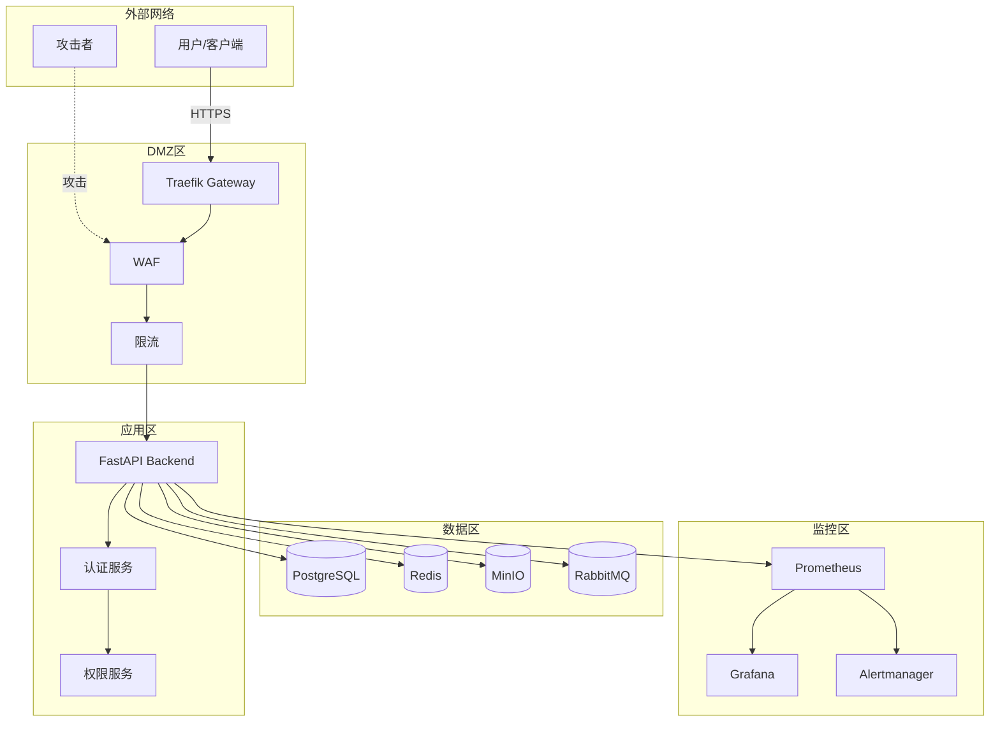
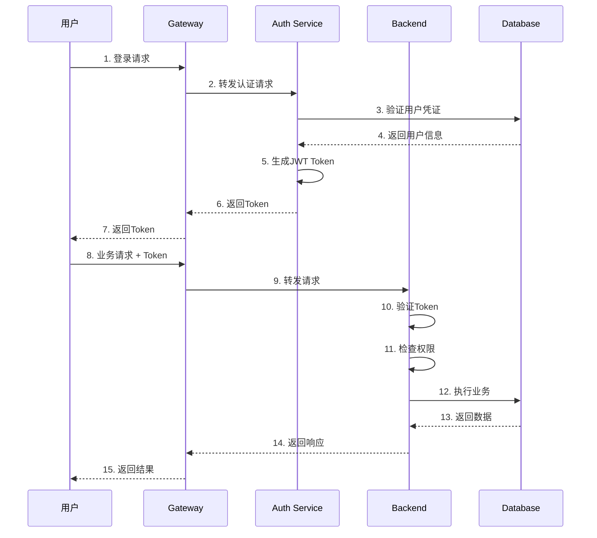

# Axiom MES 智能生产系统 - 安全架构文档

**文档版本**：1.0  
**最后更新**：2026-03-10  
**适用范围**：Axiom MES 智能生产系统安全架构设计  
**状态**：正式发布  

---

## 目录

1. [安全架构概述](#1-安全架构概述)
2. [安全分层设计](#2-安全分层设计)
3. [网络安全架构](#3-网络安全架构)
4. [应用安全架构](#4-应用安全架构)
5. [数据安全架构](#5-数据安全架构)
6. [安全组件架构](#6-安全组件架构)
7. [安全监控与审计](#7-安全监控与审计)
8. [安全架构图](#8-安全架构图)

---

## 1. 安全架构概述

### 1.1 安全架构目标

Axiom MES 智能生产系统安全架构旨在实现以下目标：

- **机密性**：确保敏感数据不被未授权访问
- **完整性**：保证数据在传输和存储过程中不被篡改
- **可用性**：确保系统服务持续可用，具备容灾能力
- **可追溯性**：所有操作可审计、可追溯
- **合规性**：满足行业安全标准和法规要求

### 1.2 安全架构原则

1. **纵深防御**：多层安全防护，单点突破不影响整体安全
2. **最小权限**：用户和系统组件仅拥有完成工作所需的最小权限
3. **默认拒绝**：默认拒绝所有访问，仅允许明确授权的访问
4. **安全透明**：安全机制对用户透明，不影响正常使用体验
5. **持续监控**：实时监控安全事件，快速响应威胁

### 1.3 安全威胁模型

| 威胁类型 | 描述 | 防护措施 |
|---------|------|---------|
| 外部攻击 | 网络入侵、DDoS攻击、恶意扫描 | 防火墙、WAF、限流、入侵检测 |
| 内部威胁 | 恶意员工、权限滥用 | RBAC、审计日志、行为分析 |
| 数据泄露 | 敏感数据被窃取或泄露 | 加密、脱敏、访问控制 |
| 身份冒用 | 账号被盗用或伪造 | 多因素认证、会话管理 |
| 应用漏洞 | SQL注入、XSS、CSRF等 | 输入校验、安全编码、漏洞扫描 |
| 供应链攻击 | 第三方组件漏洞 | 依赖审计、版本锁定、安全更新 |

---

## 2. 安全分层设计

### 2.1 安全分层架构

```
┌─────────────────────────────────────────────────────────┐
│                    用户层安全                            │
│  身份认证 │ 多因素认证 │ 会话管理 │ 密码策略            │
├─────────────────────────────────────────────────────────┤
│                    应用层安全                            │
│  输入校验 │ 输出编码 │ API安全 │ 业务逻辑安全           │
├─────────────────────────────────────────────────────────┤
│                    服务层安全                            │
│  服务认证 │ 服务授权 │ 服务间加密 │ 熔断限流            │
├─────────────────────────────────────────────────────────┤
│                    数据层安全                            │
│  数据加密 │ 访问控制 │ 数据脱敏 │ 备份恢复              │
├─────────────────────────────────────────────────────────┤
│                    网络层安全                            │
│  防火墙 │ WAF │ DDoS防护 │ 网络隔离                     │
├─────────────────────────────────────────────────────────┤
│                    基础设施安全                          │
│  容器安全 │ 主机安全 │ 物理安全 │ 环境隔离              │
└─────────────────────────────────────────────────────────┘
```

### 2.2 各层安全职责

| 层级 | 安全职责 | 关键组件 |
|------|---------|---------|
| 用户层 | 身份验证、访问控制 | OAuth2、JWT、MFA |
| 应用层 | 业务安全、输入输出安全 | FastAPI、Pydantic |
| 服务层 | 服务间通信安全、流量控制 | Traefik、mTLS |
| 数据层 | 数据保护、访问审计 | PostgreSQL、Redis、MinIO |
| 网络层 | 网络隔离、流量过滤 | Traefik、防火墙 |
| 基础设施层 | 容器安全、主机加固 | Docker、Kubernetes |

---

## 3. 网络安全架构

### 3.1 网络分区设计

```
┌──────────────────────────────────────────────────────────────┐
│                        互联网                                 │
└──────────────────────────────────────────────────────────────┘
                              │
                              ▼
┌──────────────────────────────────────────────────────────────┐
│                    DMZ区（非军事化区）                         │
│  ┌─────────────┐  ┌─────────────┐  ┌─────────────┐          │
│  │   Traefik   │  │   Grafana   │  │  Prometheus │          │
│  │   Gateway   │  │  (只读访问)  │  │  (只读访问)  │          │
│  └─────────────┘  └─────────────┘  └─────────────┘          │
└──────────────────────────────────────────────────────────────┘
                              │
                              ▼
┌──────────────────────────────────────────────────────────────┐
│                    应用区（内网）                              │
│  ┌─────────────┐  ┌─────────────┐  ┌─────────────┐          │
│  │  FastAPI    │  │   Celery    │  │   Prefect   │          │
│  │  Backend    │  │   Worker    │  │   Worker    │          │
│  └─────────────┘  └─────────────┘  └─────────────┘          │
└──────────────────────────────────────────────────────────────┘
                              │
                              ▼
┌──────────────────────────────────────────────────────────────┐
│                    数据区（内网隔离）                          │
│  ┌─────────────┐  ┌─────────────┐  ┌─────────────┐          │
│  │ PostgreSQL  │  │    Redis    │  │   MinIO     │          │
│  │TimescaleDB  │  │             │  │             │          │
│  └─────────────┘  └─────────────┘  └─────────────┘          │
│  ┌─────────────┐  ┌─────────────┐                           │
│  │ RabbitMQ    │  │Elasticsearch│                           │
│  └─────────────┘  └─────────────┘                           │
└──────────────────────────────────────────────────────────────┘
```

### 3.2 网络访问控制

| 源区域 | 目标区域 | 允许端口 | 协议 | 说明 |
|--------|---------|---------|------|------|
| 互联网 | DMZ | 80, 443 | HTTPS | Web访问 |
| DMZ | 应用区 | 8000 | HTTP | API访问 |
| 应用区 | 数据区 | 5432, 6379, 5672, 9000 | TCP | 数据库访问 |
| 应用区 | 应用区 | 8000 | HTTP | 服务间通信 |

### 3.3 Traefik 网关安全配置

```yaml
# Traefik 安全配置示例
entryPoints:
  web:
    address: ":80"
    http:
      redirections:
        entryPoint:
          to: websecure
          scheme: https
  websecure:
    address: ":443"
    http:
      tls:
        certResolver: letsencrypt

# 限流配置
http:
  middlewares:
    ratelimit:
      rateLimit:
        average: 100
        burst: 50
        period: 1m

# 安全头配置
    security-headers:
      headers:
        frameDeny: true
        browserXssFilter: true
        contentTypeNosniff: true
        forceSTSHeader: true
        stsIncludeSubdomains: true
        stsPreload: true
        stsSeconds: 31536000
```

---

## 4. 应用安全架构

### 4.1 认证授权架构

```
┌─────────────────────────────────────────────────────────────┐
│                      认证授权流程                            │
└─────────────────────────────────────────────────────────────┘

用户请求
    │
    ▼
┌─────────────┐
│  Traefik    │ ──── SSL终止、基础防护
└─────────────┘
    │
    ▼
┌─────────────┐
│  FastAPI    │ ──── JWT验证、权限检查
│  中间件     │
└─────────────┘
    │
    ├─ 无效Token ──► 401 Unauthorized
    │
    ├─ 权限不足 ──► 403 Forbidden
    │
    ▼
┌─────────────┐
│  业务处理   │ ──── 业务逻辑执行
└─────────────┘
```

### 4.2 API 安全设计

| 安全措施 | 实现方式 | 说明 |
|---------|---------|------|
| 身份认证 | OAuth2 + JWT | Token有效期30分钟，刷新Token 7天 |
| 权限控制 | RBAC | 基于角色的访问控制 |
| 输入校验 | Pydantic | 严格类型校验，防止注入 |
| 输出编码 | JSON序列化 | 防止XSS攻击 |
| 限流 | FastAPI-Limiter | 防止暴力攻击 |
| CORS | 白名单策略 | 限制跨域访问 |
| HTTPS | TLS 1.3 | 加密传输 |

### 4.3 安全中间件设计

```python
# 安全中间件示例
from fastapi import Request, HTTPException
from fastapi.security import HTTPBearer
import time
import hashlib

security = HTTPBearer()

async def security_middleware(request: Request, call_next):
    start_time = time.time()
    
    request_id = hashlib.md5(f"{time.time()}-{id(request)}".encode()).hexdigest()
    request.state.request_id = request_id
    
    response = await call_next(request)
    
    response.headers["X-Request-ID"] = request_id
    response.headers["X-Process-Time"] = str(time.time() - start_time)
    response.headers["X-Content-Type-Options"] = "nosniff"
    response.headers["X-Frame-Options"] = "DENY"
    response.headers["X-XSS-Protection"] = "1; mode=block"
    
    return response
```

---

## 5. 数据安全架构

### 5.1 数据分类与保护

| 数据级别 | 数据类型 | 存储加密 | 传输加密 | 访问控制 |
|---------|---------|---------|---------|---------|
| 绝密 | 密钥、密码、证书 | AES-256 | TLS 1.3 | 仅管理员 |
| 机密 | 个人信息、财务数据 | AES-256 | TLS 1.3 | 授权用户 |
| 内部 | 业务数据、配置 | AES-128 | TLS 1.3 | 内部用户 |
| 公开 | 公告、帮助文档 | 无 | TLS 1.3 | 所有人 |

### 5.2 数据加密架构

```
┌─────────────────────────────────────────────────────────────┐
│                      数据加密流程                            │
└─────────────────────────────────────────────────────────────┘

用户数据
    │
    ▼
┌─────────────┐
│  应用层     │ ──── 敏感字段加密（AES-256-GCM）
└─────────────┘
    │
    ▼
┌─────────────┐
│  传输层     │ ──── TLS 1.3 加密传输
└─────────────┘
    │
    ▼
┌─────────────┐
│  存储层     │ ──── 数据库透明加密（TDE）
└─────────────┘
    │
    ▼
┌─────────────┐
│  备份层     │ ──── 备份文件加密
└─────────────┘
```

### 5.3 密钥管理架构

```
┌─────────────────────────────────────────────────────────────┐
│                      密钥管理层次                            │
└─────────────────────────────────────────────────────────────┘

┌─────────────┐
│  主密钥     │ ──── KMS管理，用于加密数据密钥
│  (Master)   │
└─────────────┘
      │
      ▼
┌─────────────┐
│  数据密钥   │ ──── 用于加密业务数据
│  (Data)     │
└─────────────┘
      │
      ▼
┌─────────────┐
│  会话密钥   │ ──── 用于加密临时会话数据
│  (Session)  │
└─────────────┘
```

---

## 6. 安全组件架构

### 6.1 安全组件清单

| 组件名称 | 功能 | 技术实现 |
|---------|------|---------|
| 身份认证服务 | 用户身份验证 | OAuth2 + JWT |
| 权限管理服务 | 访问控制 | RBAC |
| 加密服务 | 数据加解密 | AES-256、RSA |
| 审计服务 | 操作审计 | 日志系统 |
| 限流服务 | 流量控制 | Redis + FastAPI-Limiter |
| WAF | Web应用防火墙 | Traefik中间件 |
| 入侵检测 | 异常行为检测 | Prometheus + Alertmanager |

### 6.2 安全组件交互

```
┌─────────────────────────────────────────────────────────────┐
│                    安全组件交互图                            │
└─────────────────────────────────────────────────────────────┘

                    ┌─────────────┐
                    │   用户请求   │
                    └─────────────┘
                          │
                          ▼
                    ┌─────────────┐
                    │   Traefik   │
                    │   Gateway   │
                    └─────────────┘
                          │
            ┌─────────────┼─────────────┐
            │             │             │
            ▼             ▼             ▼
      ┌──────────┐  ┌──────────┐  ┌──────────┐
      │   WAF    │  │  限流    │  │  入侵检测 │
      └──────────┘  └──────────┘  └──────────┘
            │             │             │
            └─────────────┼─────────────┘
                          │
                          ▼
                    ┌─────────────┐
                    │  身份认证   │
                    │   服务      │
                    └─────────────┘
                          │
                          ▼
                    ┌─────────────┐
                    │  权限管理   │
                    │   服务      │
                    └─────────────┘
                          │
                          ▼
                    ┌─────────────┐
                    │  业务服务   │
                    └─────────────┘
                          │
            ┌─────────────┼─────────────┐
            │             │             │
            ▼             ▼             ▼
      ┌──────────┐  ┌──────────┐  ┌──────────┐
      │  加密    │  │  审计    │  │  数据库  │
      │  服务    │  │  服务    │  │          │
      └──────────┘  └──────────┘  └──────────┘
```

---

## 7. 安全监控与审计

### 7.1 安全监控架构

```
┌─────────────────────────────────────────────────────────────┐
│                    安全监控架构                              │
└─────────────────────────────────────────────────────────────┘

数据采集层
    │
    ├─ 应用日志 ──► Promtail ──► Loki
    ├─ 系统指标 ──► Node Exporter ──► Prometheus
    ├─ 网络流量 ──► Traefik ──► Prometheus
    └─ 审计日志 ──► 应用 ──► Elasticsearch

数据处理层
    │
    ├─ 日志聚合 ──► Loki
    ├─ 指标聚合 ──► Prometheus
    ├─ 链路追踪 ──► Tempo
    └─ 告警处理 ──► Alertmanager

可视化层
    │
    └─ Grafana ──► 安全仪表盘

响应层
    │
    ├─ 自动响应 ──► 自动封禁、限流
    └─ 人工响应 ──► 钉钉、邮件通知
```

### 7.2 安全审计日志

| 审计事件 | 日志级别 | 存储位置 | 保留时间 |
|---------|---------|---------|---------|
| 用户登录 | INFO | Loki + Elasticsearch | 1年 |
| 权限变更 | WARNING | Elasticsearch | 3年 |
| 敏感数据访问 | WARNING | Elasticsearch | 3年 |
| 配置变更 | WARNING | Elasticsearch | 3年 |
| 安全事件 | ERROR | Elasticsearch | 5年 |
| 系统异常 | ERROR | Loki | 30天 |

### 7.3 安全告警规则

| 告警类型 | 触发条件 | 告警级别 | 通知方式 |
|---------|---------|---------|---------|
| 登录失败 | 5分钟内失败5次 | P1 | 钉钉、邮件 |
| 异常访问 | 非工作时间访问敏感数据 | P1 | 钉钉、邮件 |
| 权限滥用 | 越权访问尝试 | P0 | 钉钉、电话 |
| DDoS攻击 | 流量异常激增 | P0 | 钉钉、电话 |
| 数据泄露 | 大量敏感数据导出 | P0 | 钉钉、电话 |

---

## 8. 安全架构图

### 8.1 整体安全架构图



### 8.2 认证授权流程图



---

## 附录

### A. 安全配置清单

- [ ] 启用HTTPS（TLS 1.3）
- [ ] 配置安全响应头
- [ ] 启用限流保护
- [ ] 配置CORS策略
- [ ] 启用审计日志
- [ ] 配置安全告警
- [ ] 定期安全扫描
- [ ] 定期备份验证

### B. 安全检查清单

- [ ] 密码策略检查
- [ ] 权限配置检查
- [ ] 加密配置检查
- [ ] 日志审计检查
- [ ] 备份恢复检查
- [ ] 漏洞扫描检查

### C. 应急响应流程

1. **发现阶段**：监控告警、用户报告
2. **确认阶段**：验证安全事件、评估影响
3. **遏制阶段**：隔离受影响系统、阻止攻击
4. **根除阶段**：修复漏洞、清除威胁
5. **恢复阶段**：恢复服务、验证安全
6. **总结阶段**：分析原因、改进措施

---

**文档维护**：MES 系统架构组  
**联系方式**：[363679401@qq.com](mailto:363679401@qq.com)  
**最后更新**：2026-03-10
